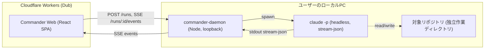

# Commander — Inception Deck

> ローカルの Claude Code を駆動する、ユーザー専用の Web 司令アプリ。
> Dub エコシステムの 1 アプリとして組み込み、最終的にこのアプリ自身をこのアプリで改善する
> 自己ホスティングのループを回す。

## 1. なぜここにいるのか (Why are we here)

今、開発の指示出しはチャット直/ターミナル起点で行われ、進行管理（demo→staging→本番のフェーズ・
ゲート・タスク台帳）は人手と Obsidian のルールで支えられている。この運用は「タスク漏れ」
「段飛ばし本番反映」を構造的に防げない。Commander は、指示から進行管理までを **1 つの Web
アプリに内蔵**し、状態機械とゲートで漏れ・段飛ばしを **仕組みで根絶**する。

## 2. エレベーターピッチ

**開発の進行を落としたくない個人開発者**向けの、**Commander** という **Web 司令アプリ**は、
**Web から指示を出すとローカルの Claude Code が実装し、その進行を demo→staging→本番の状態機械で
強制管理する**製品です。チャット直やターミナル運用と違い、**段飛ばし本番反映とタスク漏れを
コードで禁止**できます。

## 3. パッケージデザイン（製品箱）

- キャッチコピー: 「指示すれば、あとはゲートが守る」
- 3 つの売り: (1) Web からローカル Claude Code を駆動 (2) フェーズ状態機械で段飛ばし禁止
  (3) 全フェーズ移行がユーザー承認必須（自己承認不可）

## 4. やらないことリスト (Not list)

| やる（今フェーズ=基盤） | やらない（後フェーズ / 対象外） |
|---|---|
| exec ブリッジ（daemon）＋最小 Web フロントの疎通 PoC | 状態機械 UI・フェーズゲートの本実装（次フェーズ） |
| フェーズ状態機械のコア（純粋ロジック＋テスト） | Dub アプリ（ランチャー）への正式統合（次フェーズ） |
| 意思決定 docs 初版 | 認証の本格実装（当面はループバック単独運用） |
| — | マルチユーザー / 権限 / 課金（ユーザーしか使わない） |
| — | daemon の常駐サービス化・自動起動（非力 PC 制約: 手動起動のみ） |

## 5. ご近所さん（関係者・依存）

- 実行エンジン = **既存のローカル Claude Code CLI**（置き換えない。`claude -p` を spawn）
- ホスティング = Dub エコシステム（Cloudflare Workers 上のフロント）
- ルールの出所 = `~/.claude/rules/dub-development-flow.md`・`Dub_フィーチャー台帳`（状態機械の元）
- 既存 Dub 資産 = `@dub/ui` / `@dub/tokens` / `FRONTEND_GUIDE`（フロント規約）

## 6. 技術的な解決策の概要（アーキ）

Claude Code は Cloudflare Workers 上では動かせない。よって **二層構成**にする。

- フロント(Workers) と **ローカル daemon** の二層。フロントは loopback の daemon に WS/SSE 接続。
- daemon は軽量（Node 標準 http + SSE、外部ランタイム依存ゼロ）。手動起動。
- 進行管理は **フェーズ状態機械を DB 化**し、段飛ばし・自己承認をコードで禁止（ADR 0002）。

## 7. 夜も眠れなくなる問題（リスク）

| リスク | 対応 |
|---|---|
| daemon が本セッション/稼働中インスタンスに干渉 | 独立プロセス・独立作業ディレクトリ・loopback 限定 |
| ローカル daemon の露出（誰でも claude を叩ける） | 127.0.0.1 バインド固定（ADR 0003）。将来トークン追加 |
| 非力 PC で重い常駐が同時多重起動 | 常駐しない・手動起動・重いサービスの自動起動をしない |
| 状態機械の抜け穴で段飛ばし本番反映 | 遷移表を単一の真実にし純粋関数＋テストで守る（ADR 0002） |
| claude 実行の暴走・長時間化 | 1 実行=1 run で可視化、将来キャンセル/タイムアウトを追加 |

## 8. 期間の見積り

- 基盤フェーズ（本 PR）: docs 初版 ＋ 疎通 PoC がローカルで動く（完了）。
- 次フェーズ: 状態機械 UI・フェーズゲート・Dub アプリ統合。

## 9. トレードオフ（何を諦めるか）

- 「どこでも動く SaaS」は諦める。実行エンジンがローカル Claude Code である以上、
  **ローカル daemon 必須**（ユーザー専用なので許容）。
- 汎用マルチユーザー基盤は作らない。単独運用に最適化する。

## 10. 何をどれだけ（コスト感）

- 追加ランタイム課金なし（daemon は無料・ローカル。フロントは既存 Dub Workers に相乗り）。
- 実行コストは claude の利用分のみ（既存の運用と同じ）。
