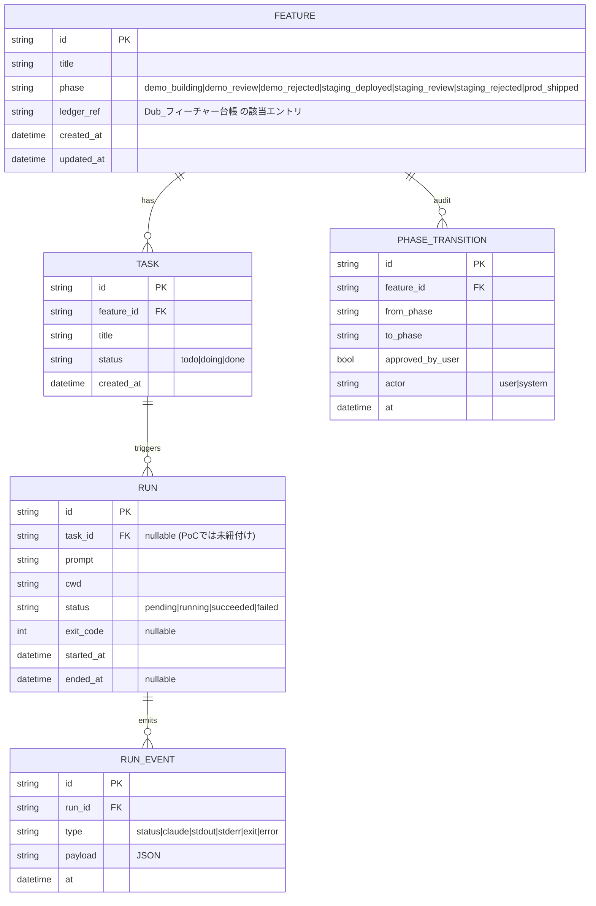

# Commander — Data Model (最小スキーマ)

基盤フェーズの最小データモデル。進行管理の核 = `Feature`（フェーズ状態機械）と、実行の記録 =
`Run` / `RunEvent`。現 PoC では `Run`/`RunEvent` は daemon 内メモリに保持し、`Feature` は
次フェーズで D1 に永続化する（本 doc はそのスキーマの初版）。

## エンティティ関係図 (ER)

## 状態機械（`Feature.phase`）

遷移の唯一の真実は `@dub/commander-phases`（`packages/commander-phases`）。daemon の
`commander/daemon/src/phases.ts` はこのパッケージを re-export するだけ（二重定義禁止）。
`commander-service` ワーカーも同じパッケージを import して遷移ゲートを適用する。要点:

| from | to | 承認要否 | 意味 |
|---|---|---|---|
| demo_building | demo_review | 不要(system) | demo デプロイ完了→確認待ち |
| demo_review | staging_deployed | **必要(user)** | demo 承認→staging 反映 |
| demo_review | demo_rejected | 不要 | demo 却下(要修正) |
| demo_rejected | demo_building | 不要 | 修正して再 demo |
| staging_deployed | staging_review | 不要(system) | staging 反映完了→確認待ち |
| staging_review | prod_shipped | **必要(user)** | staging 承認→本番反映 |
| staging_review | staging_rejected | 不要 | staging 却下(要修正) |
| staging_rejected | demo_building | 不要 | 修正して demo に戻す |

- 表に無い辺は `illegal_transition`（段飛ばし禁止）。
- 承認必要な辺は `approved_by_user=true` が無ければ `approval_required`（自己承認禁止）。
- `PHASE_TRANSITION` は監査ログ。誰が(actor)・承認有無・いつを記録する。

## 永続化の段階

- **完了（このフェーズ）**: `Feature` / `Task` / `PhaseTransition` を共有 D1 `dub-core` の
  `commander_` 名前空間に永続化（additive migration
  `infra/d1/migrations/commander/0001_commander_init.sql`）。CRUD + 遷移ゲートは
  `commander-service` ワーカー（`services/commander-service`）が担う。`commander_features`
  は 1 機能 = 1 行 = `Dub_フィーチャー台帳` の 1 エントリに対応（`ledger_ref` で紐付け）。
  `commander_phase_transitions` は追記専用の監査ログ。
  - 遷移ゲート: 遷移表に無い辺 = 段飛ばし → **409**、承認必須辺で `approvedByUser` 無し =
    自己承認 → **403**（`@dub/commander-phases`）。
- **完了（フェーズ3）**: `Run` / `RunEvent` を `commander_runs` / `commander_run_events` に永続化。
  daemon はローカル (loopback) から D1 に到達できないため、`COMMANDER_SERVICE_URL` を設定すると
  daemon が run 作成と各イベントを commander-service に POST し、ワーカーが D1 へ書く（best-effort・
  失敗しても run は止めない）。`status`/`exit` イベントは `commander_runs` 行に畳み込む（現在状態が
  1 行 read で取れる）。daemon 内メモリ（`RunStore`）は SSE 用のライブバッファとして併存する。
