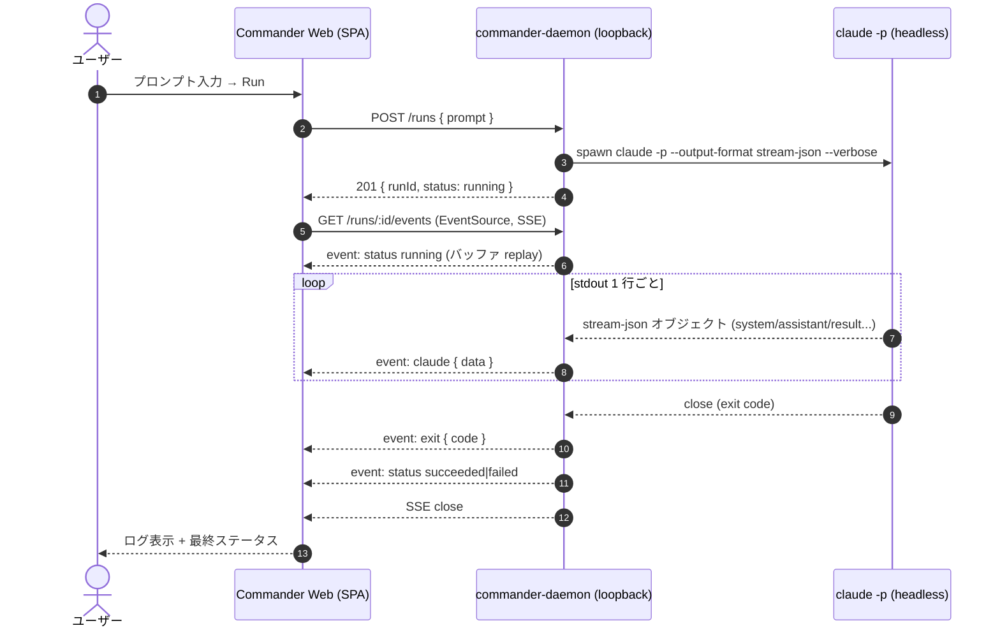
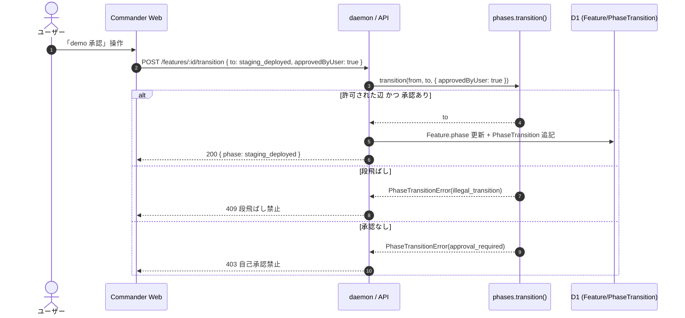

# Commander — Sequence Diagrams

## 1. 疎通 PoC: Web → daemon → claude headless → log → Web

現 PoC で実測済みのフロー（`POST /runs` → SSE → `claude -p` → stream-json → 中継 → 完了）。

## 2. フェーズ移行（次フェーズ・状態機械ゲート）

demo 承認→staging のように **承認必須**の遷移は、ユーザーの明示承認が無いと弾かれる。

