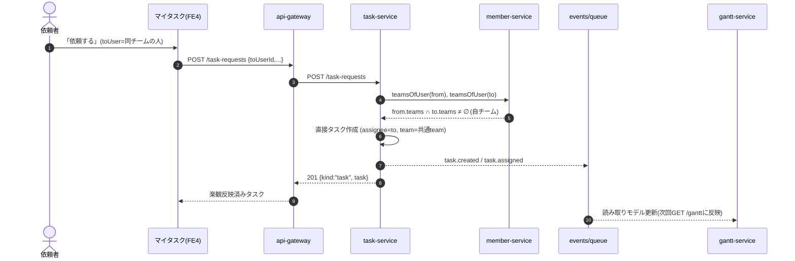
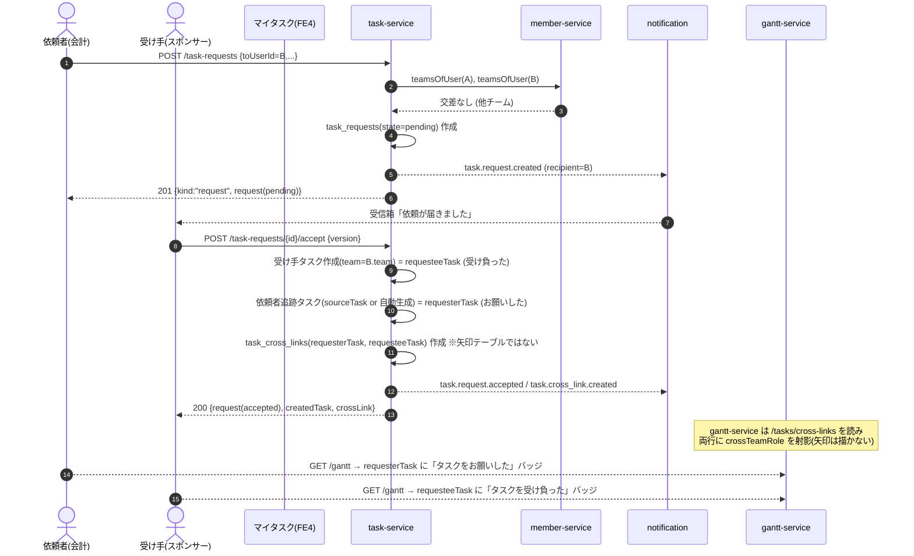
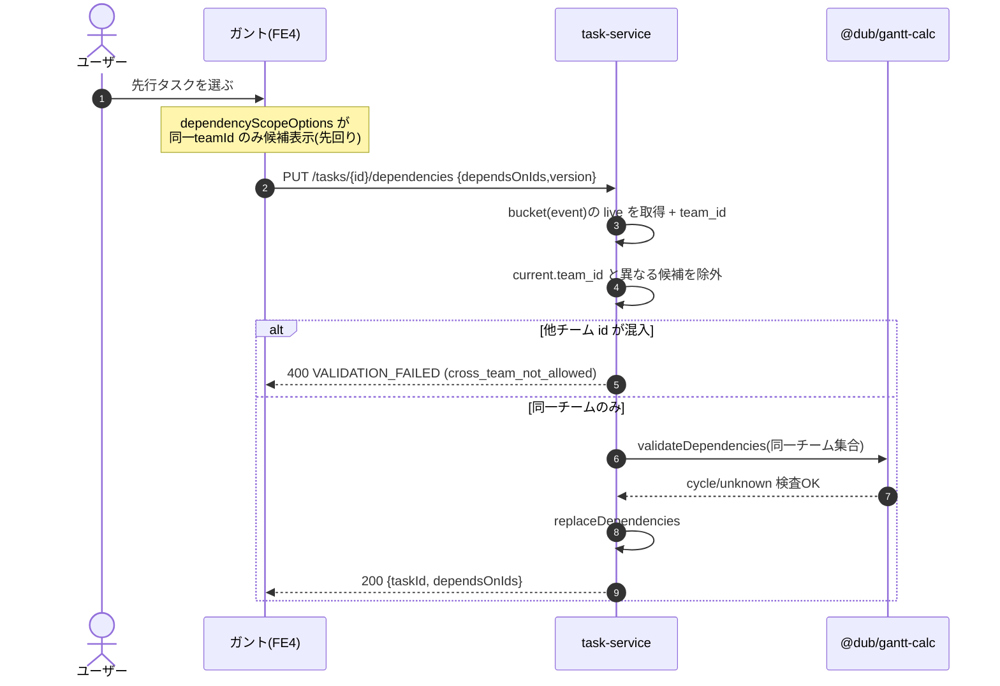

# 送る・受け取る（タスク依頼・承認 / クロスチーム依存）設計

Status: Design (v1). 実装前の設計正本。コードは変えない（この doc と、後続の極小 PR 群がSoTを更新する）。
本 doc に反する実装が出たらコードが正で、この doc を直す。

> 対象アプリは2つで **完全同期**（同じタスク実体を2形式で見せているだけ）:
> - **マイタスク**（task-service 系フロント / `apps/fe4-task-gantt` の My Tasks ビュー）
> - **ガント**（`apps/fe4-task-gantt` のガントビュー / gantt-service 読み取りモデル）
>
> 機能的にはタスク管理ツールの依頼/承認に似るが **既存 TaskTalk とは別物**。Dub 独自設計。

---

## 目次

- [1. 結論（何を作るか）](#1-結論何を作るか)
- [2. 前提（現状アーキの確定事実）](#2-前提現状アーキの確定事実)
- [3. 3本柱の設計](#3-3本柱の設計)
  - [3.1 Feature 1: 先行タスク依存の「チーム内限定」化](#31-feature-1-先行タスク依存のチーム内限定化)
  - [3.2 Feature 2: マイタスクの依頼（作成）＋ガント同期](#32-feature-2-マイタスクの依頼作成ガント同期)
  - [3.3 Feature 3: 他チーム依存の表現（承認後のステータス文言）](#33-feature-3-他チーム依存の表現承認後のステータス文言)
- [4. データモデル（additive）](#4-データモデルadditive)
- [5. API 契約（SoT 追加分）](#5-api-契約sot-追加分)
- [6. シーケンス図](#6-シーケンス図)
- [7. イベント / 通知](#7-イベント--通知)
- [8. 未確定の設計判断（推奨つき）](#8-未確定の設計判断推奨つき)
- [9. 破壊的変更を避ける方針](#9-破壊的変更を避ける方針)

---

## 1. 結論（何を作るか）

**「チーム内は矢印付き依存、チーム跨ぎは依頼→承認→ステータス文言」で一本化する。**
理由は、ガントの矢印（CPM/クリティカルパス）はチーム内の工程順序を表す道具であり、他チームへ強制的に線を引く（＝相手の都合を無視して先行タスクを差し込む）のは運用上正しくないため。他チームには「お願いする→相手が承諾する」という人間の合意を1枚挟み、その結果を**矢印ではなくステータス文言**で両者に表示する。

具体的には3つの独立した増分:

| # | 柱 | 実体 | ガント表現 |
|---|---|---|---|
| 1 | 依存のチーム内限定 | `task_dependencies`（既存）に **同一 `team_id`** 制約を足す | 矢印（従来どおり・ただし同一チーム内のみ） |
| 2 | 依頼（作成）＋承認 | 新 `task_requests`（承認状態を持つ） | 自チーム=即タスク化して同期 / 他チーム=承認まで出さない |
| 3 | 他チーム依存の表現 | 新 `task_cross_links`（矢印を引かない結線） | **矢印なし**・両タスクに自動ステータス文言 |

---

## 2. 前提（現状アーキの確定事実）

コードを読んで確定した、設計が依存する事実。

1. **依存はすでに「バケット」単位でスコープ済み**。`PUT /tasks/:id/dependencies`（`services/task-service/src/app.ts`）は
   `bucket = current.eventId ?? null` を作り、そのバケットの live タスク集合の中だけで
   `@dub/gantt-calc` の `validateDependencies`（存在・同一バケット・非archived・サイクル）を回す。
   → **チーム跨ぎ依存を止める最小改修は、この「同一バケット」条件に「同一 team_id」を足すだけ**。新サービス呼び出しは要らない（両タスクの `team_id` 比較で済む）。
2. **`task.team_id` は additive・nullable・未検証の free-form**（`infra/d1/migrations/task/0004_gantt_hierarchy.sql`、`services/task-service/src/app.ts` の create/patch はそのまま保存するだけ）。member-service の `Team.id` を指す想定だが、task-service は現状 member-service を参照しない（`deps.ts` は event-service と identity-roster のみ）。
3. **チームの正本は member-service**（`packages/types/src/member.ts`）。`Team` は `member_teams`、所属は `Member.teamIds: string[]`（**1人が複数チームに所属しうる**）。identity ログインアカウントとの橋渡しは `Member.identityUserId`。
   → 「ユーザー X はどのチームか」は `identity userId → member（identityUserId 一致）→ member.teamIds` で解決する。task-service にはこの解決口が無い（Feature 2 の自/他チーム判定で新設が要る。Feature 1 では不要）。
4. **ガント読み取りモデルはイベント単位**（`services/gantt-service/src/upstream.ts` が `GET /tasks?eventId=` と `GET /tasks/dependencies?eventId=` を引き、`dto.ts` が `GanttChartDTO` を組む）。依存線は `task_dependencies` からのみ生成され、両端が live row に無い線は落とす。
   → **cross-link を `task_dependencies` に入れない**限り、ガントに矢印は出ない（Feature 3 の要件を自然に満たす）。
5. **マイタスクのレンズは既にある**。`GET /tasks` は `assigneeId=自分`（担当）と `createdById=自分`（依頼した）で自分スコープに絞れる（`app.ts` の "My tasks" ルール）。フロントは `apps/fe4-task-gantt/src/domain/my-tasks.ts` のレンズ＋`MyTaskCreateModal`。
6. **ワイヤ契約は SoT 強制**（`docs/api-contracts/_wire-contract-enforcement.md`）。新エンドポイントは `@dub/types` に `*_WIRE` 記述子＋OpenAPI を**先に**置き、client/server/spec を CI で突合する。

---

## 3. 3本柱の設計

### 3.1 Feature 1: 先行タスク依存の「チーム内限定」化

**やること**: 依存（先行タスク）は **同じ `team_id` のタスク同士でのみ**成立させる。チーム跨ぎの矢印は一切引けない。

- **サーバ（正の門番）**: `PUT /tasks/:id/dependencies` の検証に条件を1つ足す。
  候補 `dependsOnId` のうち、`team_id` が `current.team_id` と異なるものを弾く。
  - 実装位置: `app.ts` の `liveIds`/`dependencies` 構築の直後。バケット（event）の live タスクを引くとき `team_id` も取り、`current.team_id` と一致しないものは候補集合から除外 → `validateDependencies` には同一チームのみ渡る。不一致 id は `400 VALIDATION_FAILED`（新 reason `cross_team_not_allowed`）で個別に返す。
  - `team_id === null` の扱い: **null 同士は「同一（チーム無し）」として依存可**（既存の "unlinked bucket" と同じ発想で、null チームは null チームのバケットを作る）。片方だけ null は不一致 → 弾く。
- **`task.team_id` の未検証問題**: 現状 team_id は member-service の実在 Team を指す保証が無い。Feature 1 は**文字列一致**だけで動く（実在検証は不要）ので、ここでは member-service を呼ばない。ただし将来のため「team_id は member Team.id を指す」という不変条件を doc 化し、Feature 2 で team_id を導出/検証する経路（3.2）を設ける。
- **フロント（先回りの絞り込み）**: 先行タスク候補を出す `dependencyScopeOptions(...)`（`apps/fe4-task-gantt/src/domain/task-hierarchy.ts`）に **同一 `teamId`** フィルタを足す。現状は「同じ直親（兄弟）」で絞っているだけなので、そこに team 一致を AND する。呼び出し側（`TaskCreateModal.tsx` / `TaskDetailPanel.tsx` / `PredecessorPicker.tsx`）に現タスクの `teamId` を渡す。
  - **⚠ 衝突注意**: `PredecessorPicker` 周辺は別エージェントが改修中。Feature 1 のフロント PR は**その改修が着地してから**積む（[ロードマップ](./send-receive-roadmap.md) PR15 参照）。サーバ側（門番）は独立に先行できる。

**受け入れ基準**: 他チームのタスクは候補に出ない／API 直叩きでも他チーム id は `cross_team_not_allowed` で拒否。同一チーム内は従来どおり矢印・CPM が動く。

### 3.2 Feature 2: マイタスクの依頼（作成）＋ガント同期

**やること**: 「タスク依頼（作成）」アクションを1つ追加。宛先は **自分→自分** と **自分→特定の人**。宛先の所属で分岐する。

| ケース | 判定 | 挙動 | ガント |
|---|---|---|---|
| 自分→自分 | `toUserId === 自分` | **即タスク作成**（承認なし） | すぐ出る・同期 |
| 自チーム内 | 依頼者と受け手の `teamIds` が交差する | **即タスク作成**（承認なし） | すぐ出る・同期 |
| 他チーム | 交差しない | **`task_requests`（pending）を作成**・受け手へ通知。承認まではタスク化しない | 承認後に受け手チームへ出る |

- **単一アクション / サーバが分岐**: フロントは1つの「依頼する」を叩く（`POST /task-requests`）。**自/他チームの判定はサーバが行う**（フロントの所属情報は信頼境界外なので、UX ヒント表示にのみ使う）。
  - 自/他判定にはユーザー→チーム解決が要る → task-service に **member-service クライアント**を新設（`teamsOfUser(identityUserId): TeamId[]`、`GET /members/people/by-identity/:id`）。Feature 1 では不要、Feature 2 で初めて要る（ロードマップ PR6）。
- **他チーム直接追加の封じ**: ガント上/マイタスク上で「他チームの人を assignee にした直接作成」は依頼フローを迂回してしまう。よって **`POST /tasks` に後方互換なガード**を足す: `assigneeId` の所属が、そのタスクの `team_id` と交差しない場合は `422`（依頼フローを使えの意）。
  - 後方互換のため、ガードは **`team_id` が非 null かつ assignee のチームが判明していて交差しない時だけ**発火。teamless タスク（`team_id=null`）は従来どおり誰でも assignee 可（既存挙動を壊さない）。この項は独立 PR とし、リスクが高ければ後回し可（ロードマップ PR12・任意）。
- **同期**: 自チーム/自分の依頼は普通のタスク作成なので、既存の `task.created`/`task.assigned` イベントでガントが更新される（追加実装ゼロ）。マイタスクは自分の担当/依頼レンズにそのまま乗る。

**受け入れ基準**: 自分/自チームへの依頼は1操作でタスク化しガントに出る。他チームへの依頼は `task_requests` が pending で立ち、相手に通知が飛び、こちらのガントにはまだ出ない。

### 3.3 Feature 3: 他チーム依存の表現（承認後のステータス文言）

**やること**: 他チーム依頼が**承認された後**、両チームのタスクを**矢印で結ばず**、代わりに両タスクへ自動ステータス文言を付ける。

- 依頼した側のタスク: **「タスクをお願いした」**
- 依頼された側のタスク: **「タスクを受け負った」**

- **結線は `task_cross_links`（矢印なし専用テーブル）**。`task_dependencies` には**入れない**ので、gantt-service は矢印を描かない（前提4）。cross-link は CPM/サイクル計算にも入らない（工程順序ではなく合意の記録なので正しい）。
- **ステータス文言は「保存せず導出」**（＝自動生成・常に同期の要件をコードで担保）。cross-link の役割 `role` から文言を引くだけにする:
  - `requester_task_id` 側 → role `requested` → 「タスクをお願いした」
  - `requestee_task_id` 側 → role `accepted` → 「タスクを受け負った」
  - 文言そのものは**フロントで role から生成**（i18n/表記ゆれ対策・"自動生成"に一致）。DB には role だけ。
- **両ビューへ同期表示**:
  - マイタスク: タスク行に role バッジを出す（`GET /tasks/cross-links?eventId=` を引いて id で突合、または `GET /tasks/:id` の additive 装飾）。
  - ガント: `GanttRow` に additive `crossTeamRole?: "requested" | "accepted" | null` を足し、バッジで描画（**線は引かない**）。gantt-service が cross-link を読んで射影する。
- **「双方のタスク」を必ず揃える**: 依頼された側は承認時に受け手チームにタスクが生まれる（＝`requestee_task_id`）。依頼した側は、依頼元の追跡タスク（`sourceTaskId`。無ければ承認時に依頼者チームへ追跡タスクを自動生成）を `requester_task_id` にする。これで両側にタスクが存在し、両方に文言が付く。

**受け入れ基準**: 他チーム依頼の承認後、依頼者・受け手それぞれのマイタスク／ガントに正しい文言バッジが出る。ガントに両者を結ぶ矢印は出ない。

---

## 4. データモデル（additive）

既存 `task_tasks` / `task_dependencies` は**変更しない**。2テーブルを追加するだけ（すべて additive・破壊なし）。物理正本は `infra/d1/migrations/task/`、`services/task-service/src/migrations.ts` に鏡像を置く（既存慣習）。

### 4.1 `task_requests`（依頼＝承認状態つき）

```sql
-- 0006_task_requests.sql  (namespace: task | owner: task-service)
CREATE TABLE task_requests (
  id              TEXT PRIMARY KEY,          -- treq_ ULID
  event_id        TEXT,                      -- 任意イベントスコープ（task.event_id と同義・nullable）
  from_user_id    TEXT NOT NULL,             -- 依頼者（createdBy）
  to_user_id      TEXT NOT NULL,             -- 受け手（承認後の assignee）
  from_team_id    TEXT,                      -- 依頼時点の依頼者チーム（スナップショット）
  to_team_id      TEXT,                      -- 受け手チーム（承認後タスクの team_id 既定）
  title           TEXT NOT NULL CHECK (length(title) BETWEEN 1 AND 200),
  description     TEXT,
  priority        TEXT NOT NULL DEFAULT 'medium'
                  CHECK (priority IN ('low','medium','high','urgent')),
  due_at          TEXT,
  source_task_id  TEXT,                      -- 依頼者側の追跡タスク（無ければ承認時に生成）
  state           TEXT NOT NULL DEFAULT 'pending'
                  CHECK (state IN ('pending','accepted','declined','cancelled')),
  decline_reason  TEXT,                      -- 却下理由（任意）
  created_task_id TEXT,                      -- 承認時に生まれた受け手タスク id
  version         INTEGER NOT NULL DEFAULT 1,-- 楽観ロック（accept/decline/cancel で echo）
  created_at      TEXT NOT NULL,
  decided_at      TEXT,                      -- accept/decline/cancel の時刻
  updated_at      TEXT NOT NULL
);
CREATE INDEX idx_task_requests_to   ON task_requests(to_user_id, state);
CREATE INDEX idx_task_requests_from ON task_requests(from_user_id, state);
CREATE INDEX idx_task_requests_event ON task_requests(event_id);
```

### 4.2 `task_cross_links`（他チーム結線＝矢印なし）

```sql
-- 0007_task_cross_links.sql  (namespace: task | owner: task-service)
CREATE TABLE task_cross_links (
  id                TEXT PRIMARY KEY,        -- txl_ ULID
  request_id        TEXT NOT NULL REFERENCES task_requests(id),
  requester_task_id TEXT NOT NULL REFERENCES task_tasks(id),  -- 「お願いした」側
  requestee_task_id TEXT NOT NULL REFERENCES task_tasks(id),  -- 「受け負った」側
  event_id          TEXT,                    -- 突合を軽くするための非正規化（両タスクの event）
  created_at        TEXT NOT NULL,
  UNIQUE (requester_task_id, requestee_task_id)
);
CREATE INDEX idx_task_cross_links_requester ON task_cross_links(requester_task_id);
CREATE INDEX idx_task_cross_links_requestee ON task_cross_links(requestee_task_id);
CREATE INDEX idx_task_cross_links_event     ON task_cross_links(event_id);
```

- **不変条件**: cross-link の2タスクは **異なる `team_id`**（同一チームなら `task_dependencies` を使う）。役割は id の位置で決まる（requester=「お願いした」/ requestee=「受け負った」）。
- **status 文言は導出**（保存しない）。role は id 位置から。

---

## 5. API 契約（SoT 追加分）

`@dub/types`（`packages/types/src/task.ts`）に追加する提案型。**まず型＋OpenAPI＋`TASK_REQUEST_WIRE` を置き、client/server/spec を CI 突合**（前提6）。

### 5.1 型（提案・スケルトン）

```ts
// ---- task requests (task_requests) ----
export type TaskRequestState = "pending" | "accepted" | "declined" | "cancelled";

export interface TaskRequest extends Versioned {
  id: string;                    // treq_ ULID
  eventId?: EventId | null;
  fromUserId: UserId;            // 依頼者
  toUserId: UserId;              // 受け手
  fromTeamId?: TeamId | null;
  toTeamId?: TeamId | null;
  title: string;
  description: string | null;
  priority: TaskPriority;
  dueAt: ISODateTime | null;
  sourceTaskId?: TaskId | null;  // 依頼者側の追跡タスク
  state: TaskRequestState;
  declineReason?: string | null;
  createdTaskId?: TaskId | null; // 承認で生まれた受け手タスク
  createdAt: ISODateTime;
  decidedAt: ISODateTime | null;
  updatedAt: ISODateTime;
}

// POST /task-requests のボディ。宛先の所属はサーバが解決し、自/自チーム/他チームを分岐。
export interface IssueTaskRequestBody {
  toUserId: UserId;
  title: string;
  description?: string | null;
  priority?: TaskPriority;       // 既定 medium
  dueAt?: ISODateTime | null;
  eventId?: EventId | null;
  sourceTaskId?: TaskId | null;  // 依頼者側の追跡タスク（省略時は承認で自動生成）
  targetTeamId?: TeamId | null;  // 受け手が複数チーム所属の時の指定（省略可）
}

// POST /task-requests のレスポンス（サーバ分岐の結果を判別可能にする）。
export type IssueTaskRequestResponse =
  | { kind: "task"; task: Task }            // 自分/自チーム → 即タスク化
  | { kind: "request"; request: TaskRequest }; // 他チーム → 承認待ち

export interface AcceptTaskRequestBody extends Versioned {
  targetTeamId?: TeamId | null;  // 受け手が承認時にチームを選ぶ場合
}
export interface DeclineTaskRequestBody extends Versioned {
  reason?: string;
}
export type CancelTaskRequestBody = Versioned;

export interface ListTaskRequestsQuery extends CursorQuery {
  box: "incoming" | "outgoing"; // incoming = to_user=自分 / outgoing = from_user=自分
  state?: TaskRequestState[];
  eventId?: EventId;
}
export type ListTaskRequestsResponse = Paginated<TaskRequest>;

export interface AcceptTaskRequestResponse {
  request: TaskRequest;
  createdTask: Task;      // 受け手チームに生まれたタスク（受け負った側）
  crossLink: TaskCrossLink;
}

// ---- cross-team links (task_cross_links) ----
export type TaskCrossRole = "requested" | "accepted"; // requested=お願いした / accepted=受け負った
export interface TaskCrossLink {
  id: string;                 // txl_ ULID
  requestId: string;
  requesterTaskId: TaskId;    // お願いした側
  requesteeTaskId: TaskId;    // 受け負った側
  eventId?: EventId | null;
  createdAt: ISODateTime;
}
export interface ListTaskCrossLinksResponse { items: TaskCrossLink[]; }
```

`gantt.ts`（additive）:

```ts
export interface GanttRow {
  // ...既存...
  /** 他チーム結線での役割（矢印は引かない・バッジ表示のみ）。additive/optional。 */
  crossTeamRole?: TaskCrossRole | null;
}
export interface GanttChartDTO {
  // ...既存...
  /** 他チーム結線（矢印を描かないための別チャンネル）。additive/optional。 */
  crossLinks?: TaskCrossLink[];
}
```

### 5.2 エンドポイント一覧（外部 `/api/v1` 形）

| Method & path | 権限 | 成功 | 目的 |
|---|---|---|---|
| `POST /api/v1/task-requests` | `task:write` | `201` `IssueTaskRequestResponse` | 依頼発行（自/自チーム=即タスク / 他=pending request） |
| `GET /api/v1/task-requests` | `task:read` | `200` `Paginated<TaskRequest>` | 自分の incoming/outgoing 依頼一覧 |
| `GET /api/v1/task-requests/{id}` | `task:read` | `200` `TaskRequest` | 依頼1件 |
| `POST /api/v1/task-requests/{id}/accept` | `task:write`（受け手のみ） | `200` `AcceptTaskRequestResponse` | 承諾→受け手タスク＋cross-link 生成 |
| `POST /api/v1/task-requests/{id}/decline` | `task:write`（受け手のみ） | `200` `TaskRequest` | 却下 |
| `POST /api/v1/task-requests/{id}/cancel` | `task:write`（依頼者のみ） | `200` `TaskRequest` | 依頼者が取消（pending のみ） |
| `GET /api/v1/tasks/cross-links` | `task:read` | `200` `{ items: TaskCrossLink[] }` | イベントの他チーム結線（`?eventId=` 必須・`/tasks/dependencies` と同型） |

- 変更する既存: `PUT /api/v1/tasks/{id}/dependencies` に**同一チーム制約**（Feature 1）。他チーム id は `400 VALIDATION_FAILED`（reason `cross_team_not_allowed`）。
- 任意ガード: `POST /api/v1/tasks` の cross-team assignee 拒否（Feature 2・PR12・任意）。
- 新エラーコード: `TASK_REQUEST_NOT_FOUND`(404) / `TASK_REQUEST_INVALID_STATE`(409, 例: accepted 済みを再 accept) / `TASK_REQUEST_FORBIDDEN_ROLE`(403, 受け手でない人の accept 等)。
- すべて楽観ロック（`version` echo・不一致 `409`）は既存の frozen ルールに従う。

---

## 6. シーケンス図

### 6.1 自チーム（承認なし・即同期）



### 6.2 他チーム（依頼→承認→双方にステータス文言→両ビュー同期）



### 6.3 Feature 1: 依存のチーム内限定（門番）



---

## 7. イベント / 通知

`@dub/events`（`catalog.ts` / `payloads.ts`）に additive 追加。既存の frozen 名は変えない。

| 新イベント | 発火 | payload | 購読 |
|---|---|---|---|
| `task.request.created` | 他チーム依頼の発行 | `{ requestId, fromUserId, toUserId, eventId? }` | notification, mobile-bff |
| `task.request.accepted` | 承諾 | `{ requestId, createdTaskId, sourceTaskId?, eventId? }` | notification, gantt, mobile-bff |
| `task.request.declined` | 却下 | `{ requestId, eventId? }` | notification, mobile-bff |
| `task.request.cancelled` | 依頼者取消 | `{ requestId, eventId? }` | notification, mobile-bff |
| `task.cross_link.created` | cross-link 生成 | `{ crossLinkId, requesterTaskId, requesteeTaskId, eventId? }` | gantt, mobile-bff |

- 通知は既存 `notification.requested` / notify 経路に載せる（`InboxItem` の `resourceType:"task_request"` / `resourceId:requestId`）。受け手の受信箱に「依頼が届きました」、依頼者に「承諾されました/却下されました」。
- gantt は `task.request.accepted` / `task.cross_link.created` を購読して読み取りキャッシュを purge（既存の gantt キャッシュ機構に合わせる）。

---

## 8. 未確定の設計判断（推奨つき）

| # | 判断ポイント | 選択肢 | 推奨 | 理由 |
|---|---|---|---|---|
| D1 | 自チーム依頼に承認を挟むか | (a) 承認なし即タスク / (b) 軽い承認 | **(a) 承認なし** | 同チームは既に同じ工程を共有＝合意コストが低い。要件も「自然に追加・同期」。摩擦を足さない。 |
| D2 | ステータス文言を保存 or 導出 | (a) DB保存 / (b) role から導出 | **(b) 導出** | 「自動生成・常に同期」をコードで担保。表記変更が1箇所。i18n 可能。 |
| D3 | 依頼者側タスクの用意 | (a) sourceTask 必須 / (b) 無ければ承認時に自動生成 | **(b) 自動生成フォールバック** | Feature3「双方のタスク」を常に満たす。依頼元が特定タスク発ではないケースも拾う。 |
| D4 | cross-team assignee の直接作成ガード(PR12) | (a) 入れる / (b) 入れない | **(a)（ただし team_id 非nullの時だけ発火）** | 依頼フローの迂回を塞ぐ。teamless は素通しで後方互換を維持。リスク高なら後段で。 |
| D5 | 受け手が複数チーム所属時のタスク team | (a) targetTeamId 必須 / (b) 既定=先頭 or 依頼で指定 | **(b) 依頼/承認で任意指定・既定は受け手の先頭team** | 1人多チームは普通。P0 は既定で回し、指定は任意フィールドで拡張。 |
| D6 | Feature1 の team_id 実在検証 | (a) member-service で検証 / (b) 文字列一致のみ | **(b) 一致のみ（Feature1では）** | Feature1 は比較だけで成立。検証を足すと Feature1 に member 依存が漏れる。実在検証は create/patch 側の別課題。 |

---

## 9. 破壊的変更を避ける方針

- **既存テーブル無変更**。新規2テーブルのみ（additive）。
- **`@dub/types` は additive optional のみ**（`Task` 形状は据え置き。新 interface と optional フィールドのみ足す）。frozen なイベント名・既存 payload は不変。
- **既存エンドポイント**は `PUT /dependencies` に検証を1つ足すのみ（成功形は不変・失敗形に reason 追加）。`v1` 内 additive。
- **ワイヤ契約**は `TASK_REQUEST_WIRE` を新設し CI で突合（前提6・`_wire-contract-enforcement.md` の手順）。
- **ロールアウトは極小 PR で段階化**（[send-receive-roadmap.md](./send-receive-roadmap.md)）。契約→バックエンド→フロントの順。PredecessorPicker 改修との衝突順序を明記。
